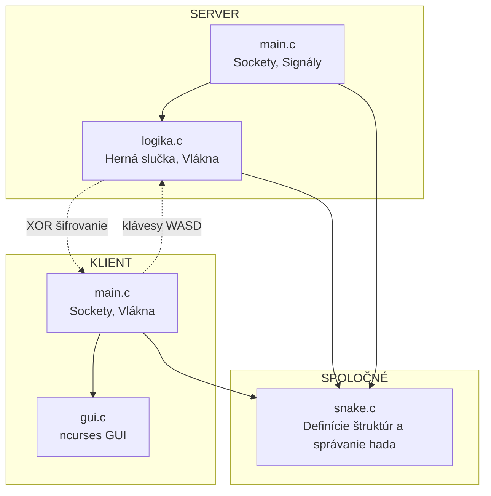
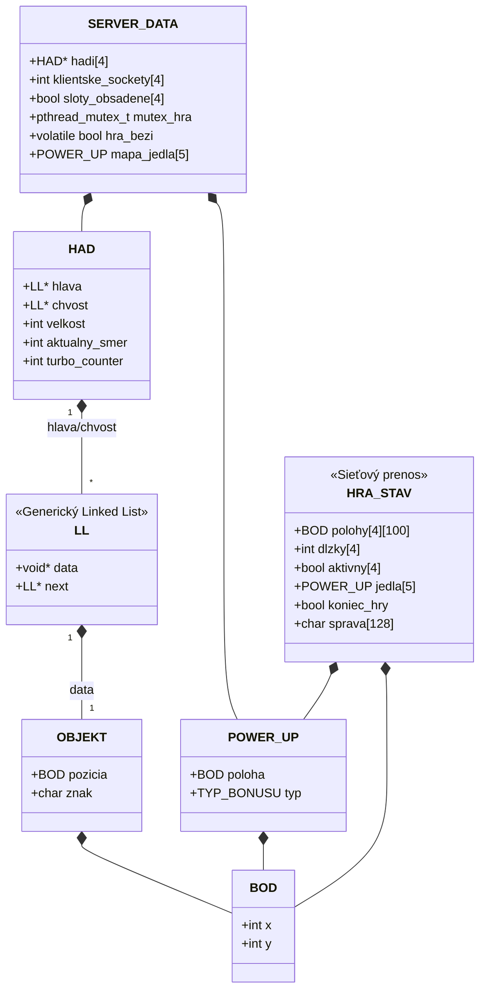
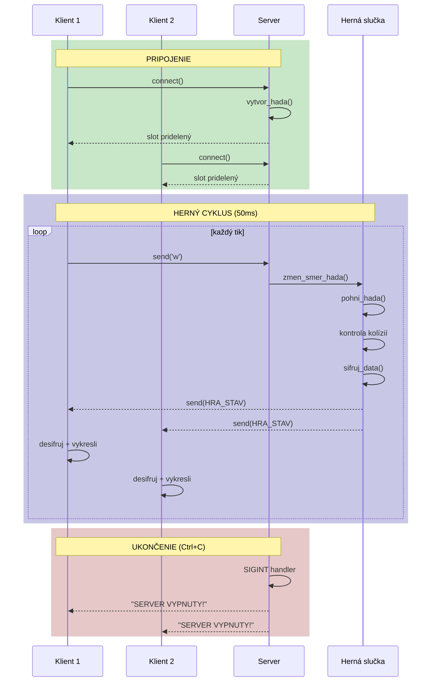
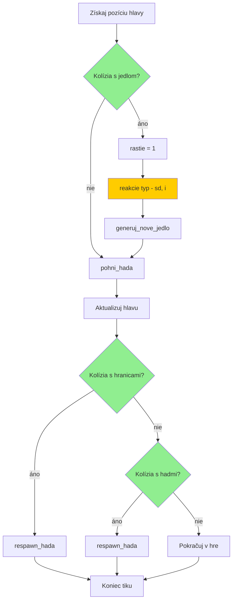
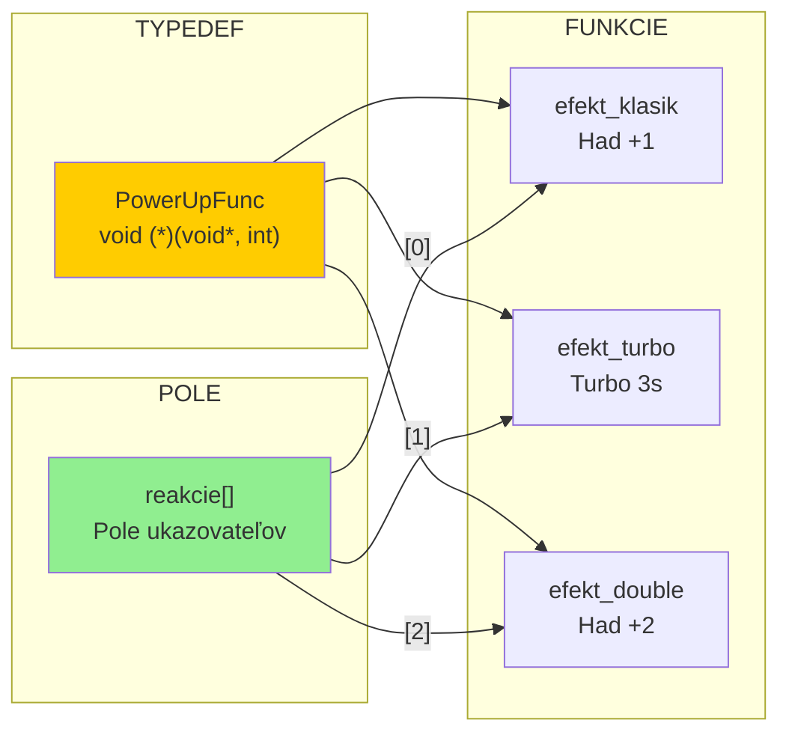
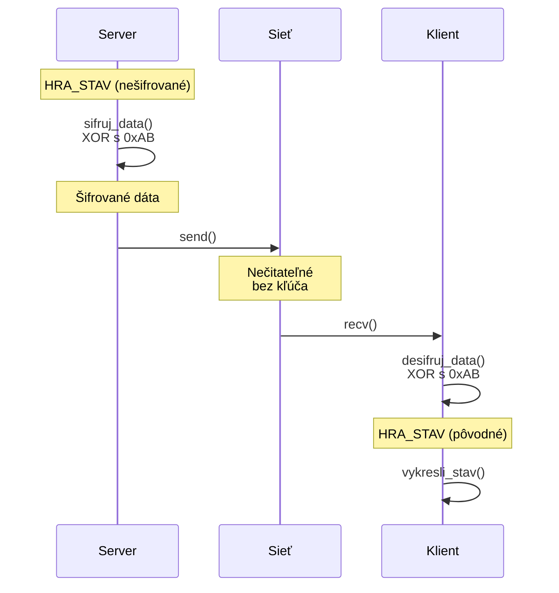

# UML DIAGRAMY - SNAKE MULTIPLAYER

## 1. KOMPONENTOVÝ DIAGRAM (Architektúra)

## 2. DIAGRAM TRIED (Štruktúry)

## 3. SEKVENČNÝ DIAGRAM (Herný cyklus)

## 4. DIAGRAM AKTIVÍT (Kontrola kolízií)

## 5. UKAZOVATELE NA FUNKCIE (Power-up systém)

## 6. ŠIFROVANIE (XOR)

---

## Ako renderovať diagramy

### PlantUML (súbor `UML_diagramy.puml`)
1. Online: https://www.plantuml.com/plantuml/uml
2. VS Code: Rozšírenie "PlantUML" (Ctrl+Shift+P → PlantUML: Preview)

### Mermaid (tento súbor)
1. GitHub automaticky renderuje Mermaid v .md súboroch
2. VS Code: Rozšírenie "Markdown Preview Mermaid Support"
3. Online: https://mermaid.live
